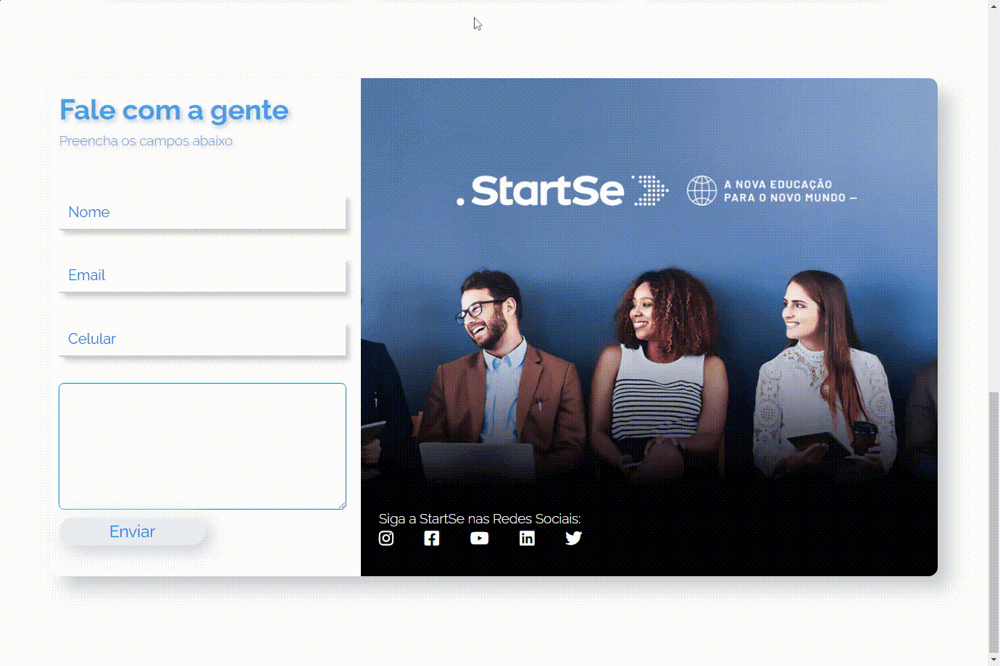

## Site Responsivo - Desafio StartSe

### Criação de site responsivo para atender ao segundo desafio do Tech Academy da StartSe
#### Objetivo principal do desafio foi a criação da seção de contato, criando um formulário do zero.
#### <i>Neste projeto foi criado um formulário responsivo utilizando CSS Grid e animações de interação entre o usuário e os campos do formulário como pode ser visto aqui:</i>

##### Confira <a href="https://holiv.github.io/startse-desafio-2">aqui</a>